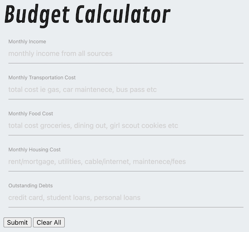
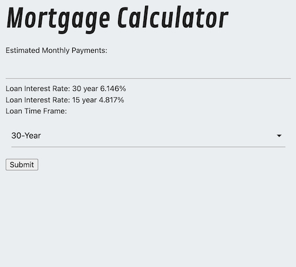

# **Group Seven - How Much House Can You Afford?**

- [GitHub Repository](https://github.com/MichaelFisher-01/Budget-Group-Project.git)
- [GitHub Live Link](https://michaelfisher-01.github.io/Budget-Group-Project/)

## *Summary* 
We have created a handy tool that a user can implement as a starting point for their home buying journey. When the user inputs their basic monthly budgeting information, our app will return the maximum total cost of home they can afford. This information will then be used to retrieve data from various API's and help the user gain insight to how much home they may be able to afford.

## *User Story:*
- **As a User** I would like to enter monthly budget amounts
- **I want** to see how much home I can afford
- **So that** I can have information to share with a real estate agent and financial advisor 

## *Acceptance Criteria:*
- **Given** I want to buy a house, but need to know how much I can afford   
- **When** I enter my budgeting information through the form
- **Then** I am given a total home loan purchase cost, as well as a short list of homes that fall within that range.

## *How To Use The Calculators*
1. Enter your monthly income, monthly cost of transportation, monthly food costs, monthly housing costs, and any outstanding monthly debt payments into each of the corresponding fields of the calculator. If you do not have costs for a specific category, leave the field blank or enter 0. Enter all values without commas or spaces. Do not enter dollar signs.

2. Click Submit
3. The total home loan purchase purchase cost will be displayed in the loan calculator, and defaults to a 30 year term at a fixed current market average interest rate. 
    - you can select different loan terms (i.e 30 yr fixed, or 15 yr fixed) to decide which type of loan is best for you. If you select the 15 year fixed rate, the interest rate will also change to reflect current market average for that loan type.

4. After editing the loan terms, click the Submit button within the loan calculator to view the new total purchase cost.

## *Help*
If you are unsure about how much to enter for each field, try to tally items in the broadest sense within the category, as this calculator is for very basic use only. Keep in mind the monthly budgeted amount for housing is being used as strict mortgage payment only and does not include other items that may affect the amount of house you can afford. Some items to consider are private mortgage insurance costs (PMI), Home Owner's Insurance (required by many lenders), estimated new monthly costs of maintenance, utilities, improvement, furniture, etc.

## *Technology Utilized*
- HTML, Javascript, CSS
- [Google Fonts](https://fonts.google.com/)
- [Materialize CSS Framework](https://materializecss.com/)
- [Home Loan Calculator API](https://rapidapi.com/yawintutor-KiiM8KV90r/api/yawin-calculator/)
- [US Real Estate API](https://rapidapi.com/datascraper/api/us-real-estate/)

## *Authors*
- Cooper Van Auken [cvanauken](https://github.com/cvanauken)
- John Proctor [thejohnp](https://github.com/thejohnp)
- Michael Fisher [MichaelFisher-01](https://github.com/MichaelFisher-01)
- Quy Nguyen [QNguyen-hub](https://github.com/QNguyen-hub)

### *Presentation Slide Deck*
[Google Slides](https://docs.google.com/presentation/d/e/2PACX-1vS4e49A-yV9bDzB1rT_7nEEEHARPL44-7AmfbFkFd9Bvia-Z0880cr_ZTeouyMPRNqc3ga9xk8uH06S/pub?start=false&loop=false&delayms=3000)